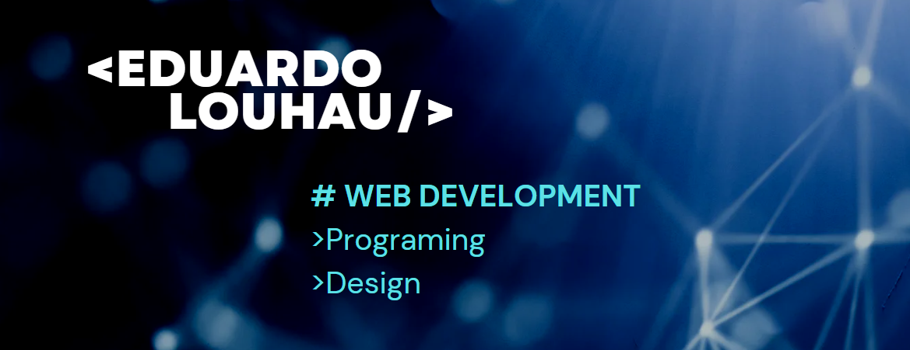

# Hello and Welcome

## I'm Eduardo Louhau

I really enjoy learning new languages and frameworks like Python and React. I also constantly work on my personal development and acquiring new skills. I have a diverse background, having worked as a civil engineer, professional musician, and automation technician. 

## 💻 Programming Skills:

